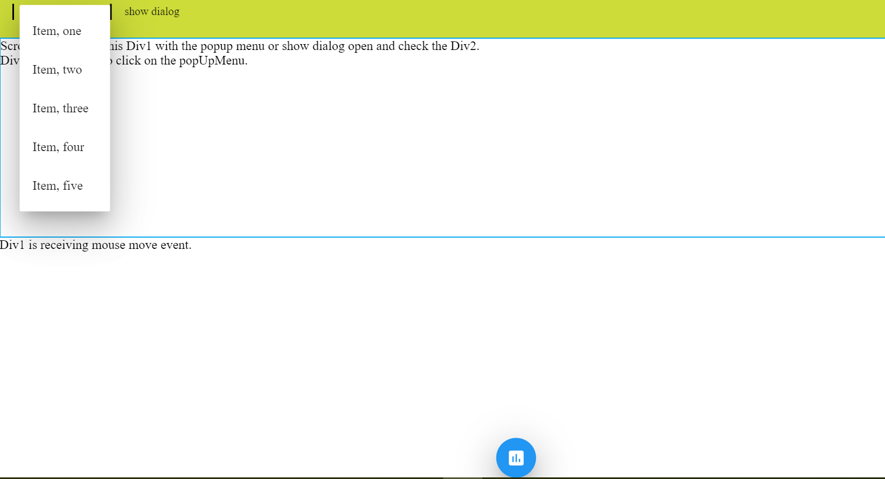
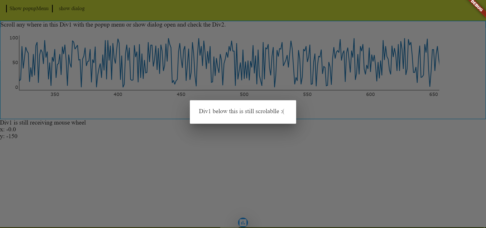

# flutter_web_htmlelementview_test

A Simple flutter project which uses HTMLElementView widget to show case some of the issues about scrolling,and click being consumed by the underlying `HTMLElementView` widget despite being overlaid by a material pop up menu or simple metrial dialog.

## How does the web app look like

## How to Run

Assuming you have fluter for being set up in your device.
If not refer [here]([https://link](https://flutter.dev/docs/get-started/web)).
1. Clone the repo
2. Run `flutter pub get`
3. Run `flutter clean`
4. Run `flutter run -d chrome`

